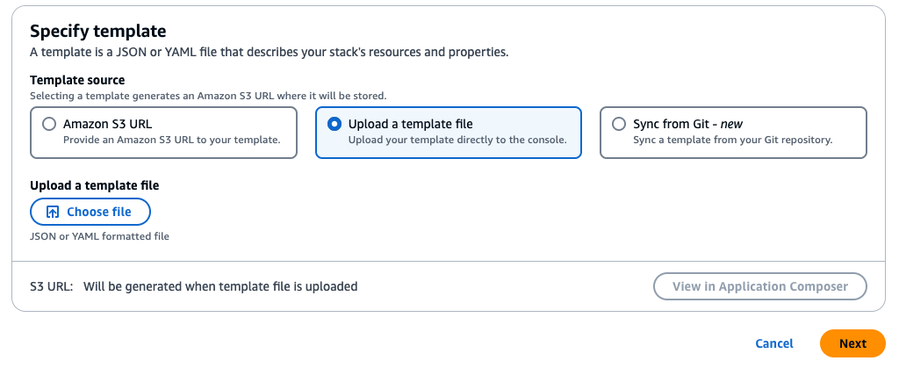
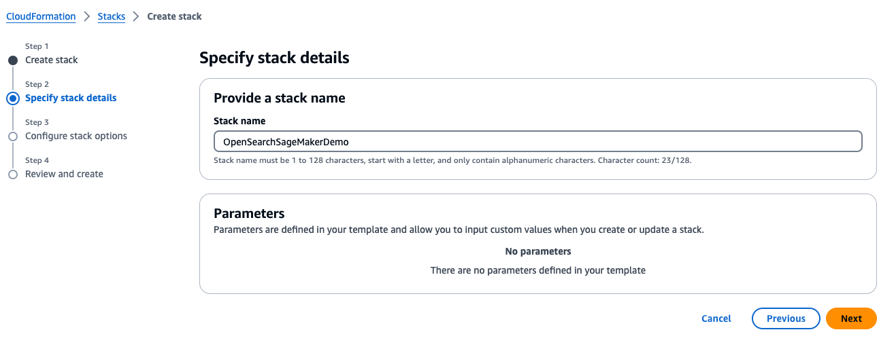

# opensearch_sagemaker_multilingual
Amazon OpenSearch using Amazon SageMaker for multilingual searching

### Step 1 - Run cloudformation template

From the AWS console navigate to the CloudFormation dashboard and select **Create stack**, then select **With new resources (standard)**

Under the **Specify template** section, select **Upload a template file**

Click **Choose file** and select the **setup.yaml** file.

On the next screen name the stack **OpenSearchSageMakerDemo**, if you choose a different name the jupyter notebook code will fail.

Finish the run stack wizard remembering to check the box on the bottom of the last screen.

Once the Stack is finished, naviate to the **SageMaker** dashboard in the console.

On the left hand menu click on the **Notebook** dropdown menu.

Click on the **Notebook instances** link.

Here you should see a notebook that has been created for you.  click on the **Open JupyterLab** link on the right.  This will launch the notebook.

On the right had side of the notebook, you will see a file directory.  Open the file named **OpensearchDemo.ipynb**.

You will be asked to select a runtime for the notebook.  Select **conda_python3**.

The rest of this tutorial will be run from the notebook you just opened.
