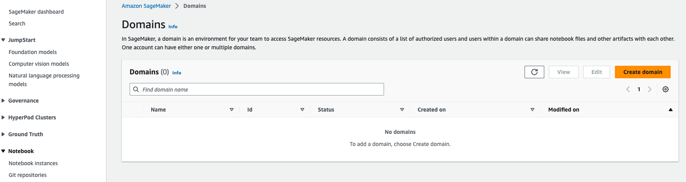
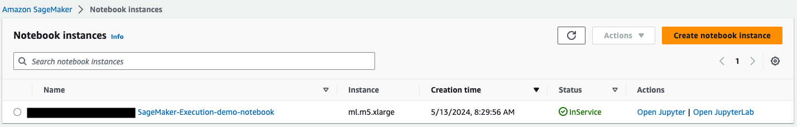
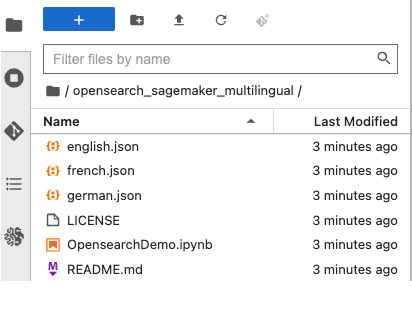
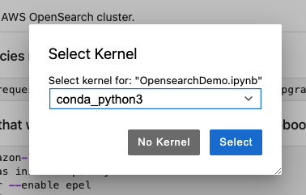

# opensearch_sagemaker_multilingual
Amazon OpenSearch using Amazon SageMaker for multilingual searching.

 **Prerequesites:**
 1. Must have AWS account

These first couple steps set up an Amazon SageMaker notebook to use for the OpenSearch SageMaker multilingual Demo. You can run these commands on AWS Cloudshell after logging into your AWS account.

please replace the placeholders ```${AWS::Region}``` and ```${AWS::AccountId}``` with your actual AWS region and account ID.

### Step 1 - Create an IAM role for Sagemaker and attatch policies
```
sed -i 's/${__AccountId__}/${AWS::AccountId}/g' sagemaker_policy.json
sed -i 's/${__Region__}/${AWS::Region}/g' sagemaker_policy.json

aws iam create-role \
    --role-name ${AWS::Region}-${AWS::AccountId}-SageMaker-Execution-demo-role \
    --assume-role-policy-document '{"Version":"2012-10-17","Statement":[{"Effect":"Allow","Principal":{"Service":"sagemaker.amazonaws.com"},"Action":"sts:AssumeRole"}]}'
```
```
aws iam attach-role-policy \
    --role-name ${AWS::Region}-${AWS::AccountId}-SageMaker-Execution-demo-role \
    --policy-arn arn:aws:iam::aws:policy/AmazonSageMakerCanvasAIServicesAccess
```
```
aws iam attach-role-policy \
    --role-name ${AWS::Region}-${AWS::AccountId}-SageMaker-Execution-demo-role \
    --policy-arn arn:aws:iam::aws:policy/AmazonSageMakerCanvasFullAccess
```
```
aws iam attach-role-policy \
    --role-name ${AWS::Region}-${AWS::AccountId}-SageMaker-Execution-demo-role \
    --policy-arn arn:aws:iam::aws:policy/AmazonSageMakerFullAccess

policy_arn=$(aws iam create-policy \
    --policy-name sagemaker-policy \
    --policy-document file://sagemaker_policy.json \
    --query 'Policy.Arn' \
    --output text)
    
aws iam attach-role-policy \
    --policy-arn $policy_arn \
    --role-name ${AWS::Region}-${AWS::AccountId}-SageMaker-Execution-demo-role
```
You can see the policy we added below or by opening the sagemaker_policy.json
```
{
	"Version": "2012-10-17",
	"Statement": [
		{
			"Action": [
				"s3:PutObject",
                "s3:GetObject",
                "s3:DeleteObject",
                "s3:ListBucket",
                "s3:CreateBucket",
                "s3:PutBucketPublicAccessBlock",
                "s3:PutEncryptionConfiguration",
                "s3:PutBucketPolicy"
			],
			"Resource": [
				"arn:aws:s3:::${AWS::Region}-${AWS::AccountId}-opensearch-sagemaker-demo-models/*",
				"arn:aws:s3:::${AWS::Region}-${AWS::AccountId}-opensearch-sagemaker-demo-models/"
			],
			"Effect": "Allow"
		},
		{
			"Action": [
				"es:CreateDomain",
				"es:DescribeDomain",
				"es:DeleteDomain",
				"es:ESHttpPost",
				"es:ESHttpPut",
				"es:CreateElasticsearchDomain",
				"es:DescribeDomainHealth"
			],
			"Resource": "arn:aws:es:${AWS::Region}:${AWS::AccountId}:domain/*",
			"Effect": "Allow"
		},
		{
			"Action": [
				"iam:PassRole"
			],
			"Resource": "arn:aws:iam::${AWS::AccountId}:role/*",
			"Effect": "Allow"
		},
		{
			"Action": [
				"cloudformation:DescribeStacks"
			],
			"Resource": "arn:aws:cloudformation:${AWS::Region}:${AWS::AccountId}:stack/OpenSearchSageMakerDemo/*",
			"Effect": "Allow"
		}
	]
}
```

### Step 2 - Create an IAM role for Amazon Opensearch and create a custom policy
Within Cloudshell, run the following command:

```
sed -i 's/${__AccountId__}/${AWS::AccountId}/g' opensearch_policy.json
sed -i 's/${__Region__}/${AWS::Region}/g' opensearch_policy.json

aws iam create-role \
    --role-name ${AWS::Region}-${AWS::AccountId}-SageMaker-OpenSearch-demo-role \
    --assume-role-policy-document '{"Version":"2012-10-17","Statement":[{"Effect":"Allow","Principal":{"Service":"opensearchservice.amazonaws.com"},"Action":"sts:AssumeRole"}]}'

policy_arn=$(aws iam create-policy \
    --policy-name sagemaker-policy \
    --policy-document file://sagemaker_policy.json \
    --query 'Policy.Arn' \
    --output text)
    
aws iam attach-role-policy \
    --policy-arn $policy_arn \
    --role-name ${AWS::Region}-${AWS::AccountId}-SageMaker-OpenSearch-demo-role
```

You can see the custom policy below.  It allows the Amazon OpenSearch service to Invoke Amazon SageMaker endpoints as well as the Amazon Comprehend DetectDominantLanguage API

```
{
	"Version": "2012-10-17",
	"Statement": [
		{
			"Action": [
				"sagemaker:InvokeEndpointAsync",
				"sagemaker:InvokeEndpoint"
			],
			"Resource": [
				"arn:aws:sagemaker:${AWS::Region}:${AWS::AccountId}:endpoint/*"
			],
			"Effect": "Allow"
		},
        {
			"Action": [
                "comprehend:DetectDominantLanguage"
			],
			"Resource": "*",
			"Effect": "Allow"
		}
	]
}
```

Now, we can open up Cloudshell again to run our final command.

### Step 3 - Create a Sagemaker notebook instance
```
aws sagemaker create-notebook-instance \
    --notebook-instance-name ${AWS::Region}-${AWS::AccountId}-SageMaker-Execution-demo-notebook \
    --instance-type ml.m5.xlarge \
    --role-arn arn:aws:iam::${AWS::AccountId}:role/${AWS::Region}-${AWS::AccountId}-SageMaker-Execution-demo-role \
    --volume-size-in-gb 100 \
    --default-code-repository https://github.com/jtrollin/opensearch_sagemaker_multilingual
```

Once the Sagemaker notebook instance has been successfully created, naviate to the **SageMaker** dashboard in the console.

On the left hand menu click on the **Notebook** dropdown menu.


Click on the **Notebook instances** link.


Here you should see a notebook that has been created for you. Once the status of the notebook shows as **InService**  click on the **Open JupyterLab** link on the right.  This will launch the notebook.

On the right had side of the notebook, you will see a file directory.  Open the file named **OpensearchDemo.ipynb**.


You will be asked to select a runtime for the notebook.  Select **conda_python3**.


The rest of this tutorial will be run from the notebook you just opened.
